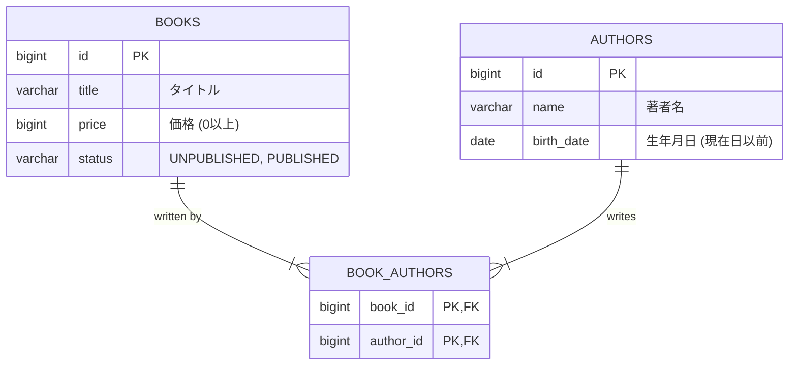

# Design Document

## 1. データベース設計 (ER図)

書籍 (`books`) と著者 (`authors`) は多対多の関係（1冊の本を複数人で執筆可能、1人の著者が複数冊執筆可能）であるため、中間テーブル (`book_authors`) を導入します。



## 2. ステータス遷移図 (書籍の出版状況)

書籍の出版状況 (`status`) に関するビジネスルールです。
「出版済み (`PUBLISHED`)」となった書籍を「未出版 (`UNPUBLISHED`)」に戻すことはできません。

```mermaid
stateDiagram-v2
    [*] --> UNPUBLISHED : 新規登録
    UNPUBLISHED --> PUBLISHED : 出版処理 (Update)
    PUBLISHED --> PUBLISHED : 情報更新 (Update)
    PUBLISHED --> UNPUBLISHED : 変更不可 (Error)